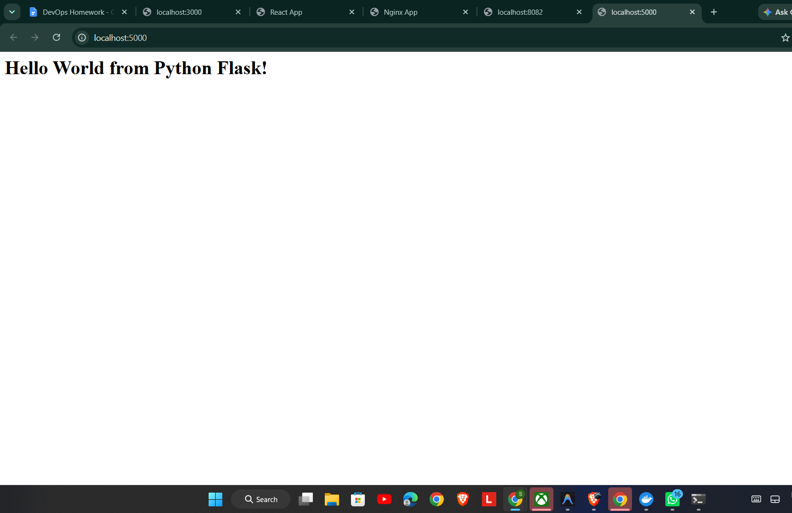
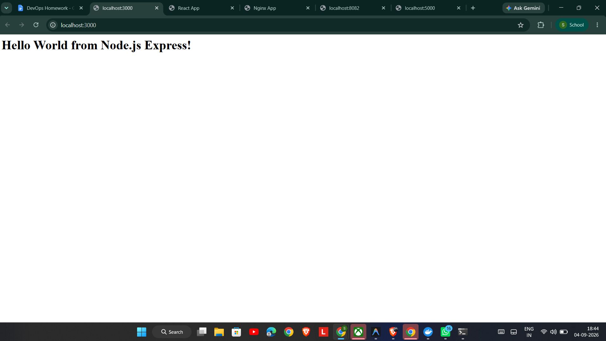
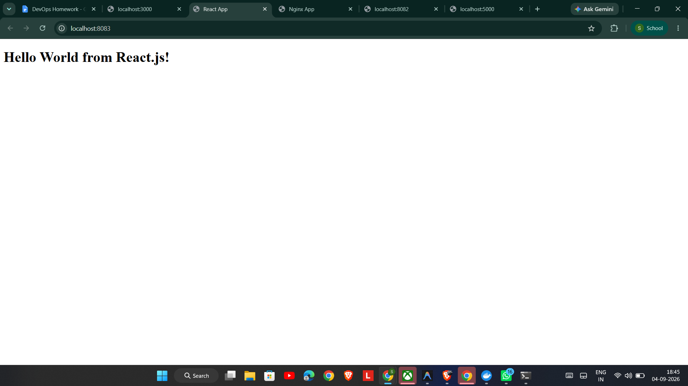
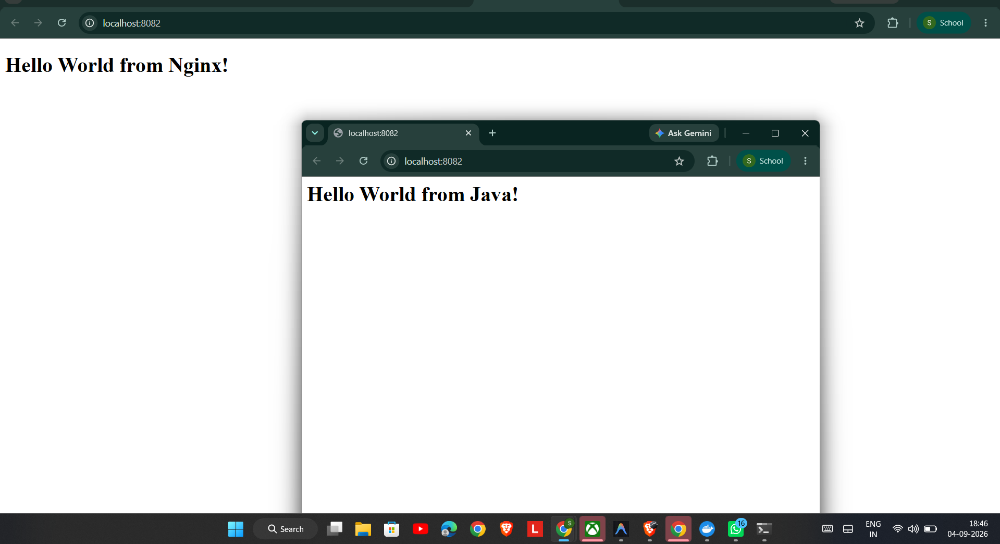

# Docker Fundamentals Assignment

## What I Did

In this assignment, I containerized 6 different web applications using Docker. Each app simply returns a "Hello World" message and runs inside its own Docker container. I wrote a `Dockerfile` for each one.

---

## Apps I Containerized

### 1. Apache HTTP Server
- I used the base image `httpd:2.4-alpine`
- Copied my `index.html` into the Apache web root at `/usr/local/apache2/htdocs/`
- The app runs on port `80` inside the container
- I mapped it to port `8080` on my local machine

### 2. Nginx
- I used the base image `nginx:alpine`
- Copied my `index.html` into `/usr/share/nginx/html/`
- Runs on port `80` inside the container
- Mapped to port `8081` on my machine

### 3. Python Flask
- Used `python:3.11-slim` as the base image
- Wrote a simple Flask app in `app.py` that returns `Hello World from Python Flask!`
- Installed dependencies using `requirements.txt` with `pip install`
- App runs on port `5000`

### 4. Node.js Express
- Used `node:20-alpine` as the base image
- Wrote a simple Express server in `server.js` that sends `Hello World from Node.js Express!`
- Installed dependencies using `npm install`
- App runs on port `3000`

### 5. Java (Built-in HTTP Server)
- Used `eclipse-temurin:21-jdk-alpine` as the base image
- Wrote `HelloWorldServer.java` using Java's built-in `com.sun.net.httpserver.HttpServer`
- Compiled it inside the container using `javac` in the Dockerfile
- App runs on port `8080` inside the container
- Mapped to port `8082` on my machine

### 6. React.js
- Used a **multi-stage build**
  - **Stage 1 (Build):** Used `node:20-alpine` to run `npm install` and `npm run build`
  - **Stage 2 (Serve):** Copied the built files into `nginx:alpine` to serve them
- Final app runs on port `80` inside the container
- Mapped to port `8083` on my machine

---

## How to Build and Run

I built and ran each image individually using these commands from the project root:

```bash
# Apache
docker build -t apache-app:latest ./Apache-app
docker run -d -p 8080:80 apache-app:latest

# Nginx
docker build -t nginx-app:latest ./nginx-app
docker run -d -p 8081:80 nginx-app:latest

# Python Flask
docker build -t python-app:latest ./python-app
docker run -d -p 5000:5000 python-app:latest

# Node.js Express
docker build -t nodejs-app:latest ./nodejs-app
docker run -d -p 3000:3000 nodejs-app:latest

# Java
docker build -t java-app:latest ./java-app
docker run -d -p 8082:8080 java-app:latest

# React
docker build -t react-app:latest ./React-app
docker run -d -p 8083:80 react-app:latest
```

---

## Localhost Links (After Running)

| App | URL |
|-----|-----|
| Apache | http://localhost:8080 |
| Nginx | http://localhost:8081 |
| Python Flask | http://localhost:5000 |
| Node.js Express | http://localhost:3000 |
| Java | http://localhost:8082 |
| React | http://localhost:8083 |

---

## Screenshots

### Apache


### Python Flask


### Node.js Express




---

## Cleanup

To stop and remove all running containers:

```bash
docker stop $(docker ps -q --filter "ancestor=apache-app:latest")
docker stop $(docker ps -q --filter "ancestor=nginx-app:latest")
docker stop $(docker ps -q --filter "ancestor=python-app:latest")
docker stop $(docker ps -q --filter "ancestor=nodejs-app:latest")
docker stop $(docker ps -q --filter "ancestor=java-app:latest")
docker stop $(docker ps -q --filter "ancestor=react-app:latest")
```