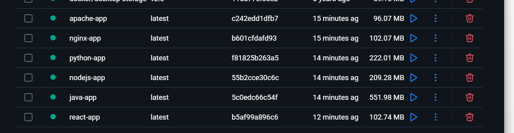

# Docker Fundamentals Assignment

This repository contains 6 distinct web applications, each containerized using Docker. Every application serves a simple "Hello World" message and is configured with its own `Dockerfile`.

## Applications Included

1. **Node.js (Express)**: Built with `node:20-alpine`. Serves on port `3000`.
2. **Python (Flask)**: Built with `python:3.11-slim`. Serves on port `5000`.
3. **Java (Built-in HTTP Server)**: Built with `eclipse-temurin:21-jdk-alpine`. Serves on port `8080`.
4. **Apache HTTP Server**: Built with `httpd:2.4-alpine`. Serves static HTML on port `80`.
5. **React.js**: Multi-stage build using `node:20-alpine` for building and `nginx:alpine` for serving on port `80`.
6. **Nginx**: Built with `nginx:alpine`. Serves static HTML on port `80`.

## Automated Verification

A bash script (`verify.sh`) is included to automate the building and running of all 6 containers simultaneously. It maps each application to a unique host port and uses `curl` to verify the outputs.

### Running the Script

On Windows, you can run this script using Git Bash or WSL. On Linux/macOS, you can run it directly in your terminal:

```bash
bash verify.sh
```

### Port Mappings

When running the verification script, the applications are mapped to the following host ports:
- **Node.js**: `http://localhost:3000`
- **Python**: `http://localhost:5000`
- **Java**: `http://localhost:8080`
- **Apache**: `http://localhost:8081`
- **React.js**: `http://localhost:3001`
- **Nginx**: `http://localhost:8082`

## Manual Build and Run

To manually build and run an individual application, navigate into its respective directory and use the Docker CLI:

```bash
# Example for the Node.js application
cd nodejs-app

# Build the image
docker build -t my-node-app .

# Run the container (mapping host port 3000 to container port 3000)
docker run -d -p 3000:3000 my-node-app
```

## Cleanup

To stop and remove all containers created by the verification script, run:

```bash
docker stop node-container python-container java-container apache-container react-container nginx-container
docker rm node-container python-container java-container apache-container react-container nginx-container
```

